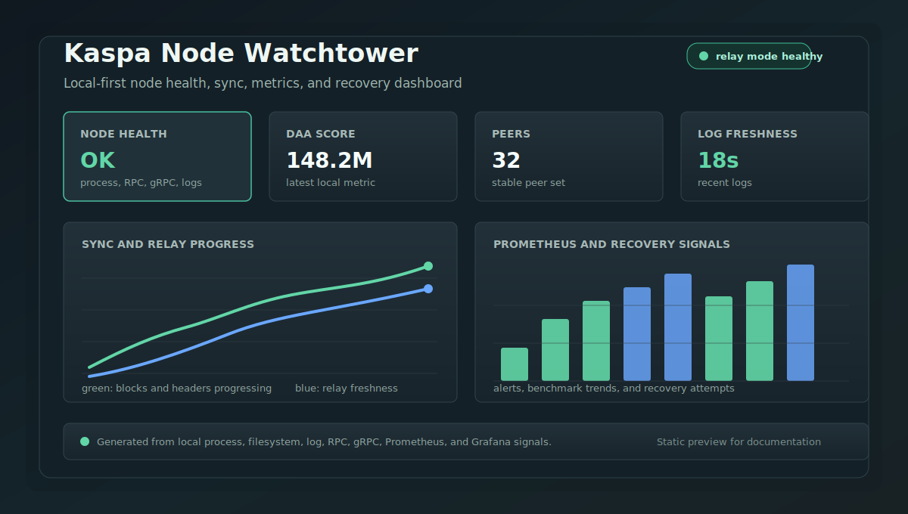

# Kaspa Node Watchtower

[](https://github.com/psdjcraw/Kaspa-Node-Watchtower/actions/workflows/smoke.yml)
[](https://github.com/psdjcraw/Kaspa-Node-Watchtower/actions/workflows/codeql.yml)
[](LICENSE)


Lightweight monitoring and reporting tools for a local Kaspa node.

## Goal

Kaspa Node Watchtower watches a local `kaspad` process, summarizes sync progress,
and helps operators understand node health without relying only on external
explorers or hosted APIs.

## Why This Matters

Self-hosted Kaspa nodes are healthier when operators can inspect their own
systems directly. Hosted explorers and public APIs are useful references, but
they should not be the only source of truth for node health, sync progress, or
relay freshness.

Kaspa Node Watchtower helps operators keep local visibility over their nodes
with direct process, filesystem, log, RPC, gRPC, Prometheus, and Grafana signals.
That makes independent node operation easier to monitor, debug, and recover,
which supports a more resilient decentralized network.

## Dashboard Preview



## Features

- Node health checks: process, RPC TCP, gRPC metrics, disk free space, data directory, log freshness, and relay block progress
- Sync reports: IBD start/end time, processed blocks, headers, and throughput
- Alert-mode output for Discord/OpenClaw cron
- JSON output for later dashboards or exporters
- Direct rusty-kaspa gRPC metrics: sync status, peers, network id, DAA score,
  block/header counts, mempool, DAG tips, pruning point, difficulty, estimated
  network hashrate, and process metrics
- Alert severity, repeat suppression, maintenance mute, incident duration
  tracking, health score, and polished local HTML status page generation
- Tabbed `status.html` layout that separates Market, Futures, Network, Ops,
  and History views so dense operator data is not shown all at once
- Concise `--summary` output for quick Discord/operator status checks
- Benchmark snapshots and reports for version/configuration comparison
- Benchmark trend section in the generated status dashboard
- Relay accepted-block event chart from recent `Accepted N blocks ... via relay`
  kaspad log entries
- Blocks-per-second processing chart from recent `Processed N blocks ...`
  kaspad log entries
- Transactions-per-second card and throughput chart from recent
  `Processed N blocks ... (N transactions)` kaspad log entries
- Prometheus/Grafana transaction-throughput metrics for processed tx/s
- Processed-stats freshness tracking and Prometheus alerting for stale
  transaction throughput data, including local dashboard warning checks,
  Tx Rate card warning state, and a Grafana freshness panel
- Mempool size 10-second candle chart in the generated status dashboard, plus
  a bundled Grafana mempool timeseries panel
- Estimated network hashrate card and trend chart in the generated status
  dashboard
- Live KAS/USDT market watch in the generated status dashboard, including
  Bybit spot price, 15-minute/4-hour/daily/weekly/monthly candle charts, and a
  normalized daily KAS/USDT vs BTC/USDT cross chart with browser cache fallback;
  KAS/USDT timeframe charts include EMA overlays, short-trend status badges,
  RSI 14 badges, a compact Signal Watch summary, and operator-focused time
  ranges from intraday through full monthly history; the market section also
  shows daily KAS exchange-volume bars for Gate, MEXC, KuCoin, Bybit, Bitget,
  Kraken, HTX, and Total, plus estimated Bybit KAS/USDT futures liquidation
  heatmaps for 12-hour, 24-hour, 1-week, and 1-month ranges and a linear perp
  positioning panel for funding, basis, and open interest context; a 7-day
  futures trend panel plots open interest with funding-rate bars; browser
  market-data refreshes are throttled per panel to avoid unnecessary public API
  calls for long-window data, with a source-status panel for live, cached, or
  unavailable public API groups in a stable operator-facing order with short
  failure details; daily and weekly reports also include an optional Bybit
  KAS/USDT spot/futures market snapshot for price, basis, funding, and open
  interest context, with persisted snapshot metrics available in Prometheus and
  the bundled Grafana dashboard
- Prometheus textfile metrics for local scraping or textfile collectors
- Long-lived SQLite history export and operator summary reporting
- Watch-only wallet balance monitoring through the local Kaspa gRPC endpoint;
  no private keys, signing, or transaction sending are handled by Watchtower
- Wallet balance-change alerts and Grafana panels for total balance, balance
  delta, and address-level balances
- Wallet transaction view with address-related mempool entries and a local
  balance-change event timeline
- Mining reward summary cards for wallet events labeled `mining`, including
  today/7-day/30-day KAS and USD estimates from the latest market snapshot
- Mining tab scaffold for external miner monitoring on macOS experiments,
  including process state, parsed hashrate, share counts, and Prometheus metrics
- Whale watch for 1M+ KAS single-output mempool transactions, with event
  history, Discord alerts, dashboard tab, and Prometheus metrics

## Planned Features

- Add more external long-term storage options beyond portable local archives

## Current Context

Current target environment:

- Kaspa mainnet
- Local `rusty-kaspa` / `kaspad`
- macOS host
- Discord-based operational updates

## Documentation

- [Install guide](docs/install.md)
- [v0.8 release install guide](docs/release-install-guide-v0.8.md)
- [Operations guide](docs/operations.md)
- [Prometheus/Grafana integrations](docs/integrations.md)
- [Compatibility guide](docs/compatibility.md)
- [Failure handling runbook](docs/runbook.md)
- [Deployment status](docs/status.md)
- [Sample status reports](docs/sample-status-reports.md)
- [Long-lived storage options](docs/storage-options.md)
- [Packaging options](docs/packaging-options.md)
- [v0.7.0 release notes](docs/release-notes-v0.7.0.md)
- [v0.6.1 release notes](docs/release-notes-v0.6.1.md)
- [v0.6.0 release notes](docs/release-notes-v0.6.0.md)
- [v0.5.0 release notes](docs/release-notes-v0.5.0.md)
- [v0.4.0 release notes](docs/release-notes-v0.4.0.md)
- [v0.2.0 release notes](docs/release-notes-v0.2.0.md)
- [Roadmap](ROADMAP.md)
- [Contributing guide](CONTRIBUTING.md)
- [Security policy](SECURITY.md)
- [Changelog](CHANGELOG.md)

## Status

First working local watchtower.

## Quick Start

Run guided local onboarding checks:

```bash
make onboard
```

Run the local status reporter:

```bash
.venv/bin/python watchtower.py -c config.example.json
```

For the current local node:

```bash
.venv/bin/python watchtower.py -c config.json
```

For a concise operator summary:

```bash
.venv/bin/python watchtower.py -c config.json --summary
.venv/bin/python watchtower.py -c config.json --sync-report
.venv/bin/python watchtower.py --market-summary
make diagnostics-summary
```

For a planned restart or upgrade window:

```bash
make maintenance-status
make mute MUTE_MINUTES=30 MUTE_REASON="kaspad upgrade"
make unmute
```

Discord/OpenClaw command bridge targets:

```bash
make discord-status
make discord-incidents
make discord-wallet
make discord-wallet-txs
make discord-mining
make discord-whales
make mining-set-address MINING_ADDRESS="kaspa:q..."
make mining-clear-address
make discord-mute MUTE_MINUTES=30 MUTE_REASON="kaspad upgrade"
make discord-unmute
```

Enable watch-only wallet monitoring by adding address labels to `config.json`:

```json
"wallet": {
  "enabled": true,
  "alert_on_change": true,
  "alert_min_delta_sompi": 1,
  "alert_directions": "all",
  "large_outgoing_alert_sompi": 0,
  "mining_reward_stale_hours": 0,
  "event_history_entries": 50,
  "watch_addresses": [
    {
      "label": "mining",
      "address": "kaspa:q...",
      "alert_enabled": true,
      "alert_min_delta_sompi": 1,
      "alert_directions": "incoming"
    }
  ]
}
```

Enable the first macOS mining monitor scaffold by pointing Watchtower at an
external miner process/log. This does not start or stop a miner; it only
monitors the process, parsed hashrate, shares, and pool context for the Mining
tab and Prometheus metrics.

Store the mining payout address with the helper command so the miner monitor,
Mining tab, and future miner command templates all read the same public payout
address. Never put private keys, seed phrases, or wallet files in Watchtower
config.

```bash
make mining-set-address MINING_ADDRESS="kaspa:q..."
make mining-clear-address
```

```json
"mining": {
  "enabled": true,
  "mode": "macos-gpu-experimental",
  "process_match": "kaspa-miner",
  "log_path": "state/miner.log",
  "pool_url": "stratum+tcp://pool.example:port",
  "wallet_address": "kaspa:q...",
  "worker_name": "macos-gpu-test",
  "expected_hashrate_min_hs": 0,
  "stale_share_minutes": 0
}
```

Enable 1M+ KAS whale detection from the local mempool snapshot:

```json
"whale_watch": {
  "enabled": true,
  "confirmed_enabled": true,
  "min_amount_sompi": 100000000000000,
  "alert_enabled": true,
  "event_history_entries": 100
}
```

`min_amount_sompi=100000000000000` is exactly 1,000,000 KAS. When enabled,
Watchtower records each single transaction output at or above the threshold,
dedupes by source, tx id, amount, and address, tracks pending mempool events,
then uses `GetVirtualChainFromBlockV2` to record confirmed events after the
first chain-hash baseline is established. It emits a `whale_tx_detected` alert
for new pending or confirmed events.

Print the watchtower version:

```bash
.venv/bin/python watchtower.py --version
make version
```

Validate local configuration:

```bash
.venv/bin/python watchtower.py -c config.json --validate-config
```

Validation output includes failed setting names and expected value hints so
operators can fix local config version, path, endpoint, threshold, and
retention mistakes without reading the code. It also checks v0.8 migration
surface such as `sqlite_history_path`, node-name format, distinct history and
metrics paths, bundled Prometheus rules, bundled Grafana JSON, and optional
multi-node threshold environment overrides.

The reporter reads local process state, RPC TCP reachability, direct gRPC
metrics, data directory size/free space, and recent `kaspad` logs. It reports
IBD/catch-up completion counts, trusted block counts, latest relay activity,
latest transaction throughput stats, and recent relay block progress for stall
detection.

For gRPC metrics, create the local virtualenv and generated protobuf files:

```bash
make bootstrap
make proto-check
```

For local edits, copy `config.example.json` to `config.json` and adjust paths.
`config.json` is ignored by git.

Cron-friendly alert mode:

```bash
./run_watchtower.sh
```

Common operator commands are also available through `make`:

```bash
make help
make status
make stream
make sync-report
make incident-report
make smoke
make daily-report
make weekly-report
make weekly-archive
make recover-dry-run
make ensure-exporter
make diagnostics-archive
make history-report
make history-multi-node
make history-archive
make upload-archive ARCHIVE_SOURCE=state/history-archives/smoke ARCHIVE_TARGET=/Volumes/node-backups
make package
```

Save a benchmark snapshot and compare recent snapshots:

```bash
.venv/bin/python watchtower.py -c config.json --benchmark-snapshot
.venv/bin/python watchtower.py -c config.json --benchmark-report
```

Capture upgrade checkpoints:

```bash
scripts/upgrade_checkpoint.py before --label pre-upgrade
scripts/upgrade_checkpoint.py after --label post-upgrade
scripts/upgrade_checkpoint.py report
```

Export history to SQLite:

```bash
scripts/export_history_sqlite.py
scripts/export_history_sqlite.py --summary --days 7
scripts/export_history_sqlite.py --multi-node-summary --days 7
make history-report
make history-multi-node
make history-archive
make weekly-archive
```

This imports benchmark snapshots, market snapshots, upgrade checkpoints, and
recovery attempts, then can summarize the latest history window for operator
review, including processed transaction rate, processed-stats freshness, and
latest KAS/USDT spot/futures market context.
`make history-archive` also writes a portable archive under
`state/history-archives/` with the SQLite snapshot, source JSONL files, summary
JSON, and a manifest for off-host backup or object storage upload.
`make weekly-archive` prints the weekly report and writes a dated history
archive in the same pass.
`make history-multi-node` compares per-node status, severity, peer floors, disk
floors, DAA/block deltas, per-network latest DAA/block lag, and risk flags from
the SQLite history. Thresholds can be tuned with
`MULTI_NODE_DAA_LAG_WARNING`, `MULTI_NODE_BLOCK_LAG_WARNING`,
`MULTI_NODE_STALE_MINUTES`, `MULTI_NODE_PEER_LAG_WARNING`, and
`MULTI_NODE_PROCESSED_AGE_LAG_WARNING`.
The HTML status page and `scripts/ops_snapshot.sh` surface the same multi-node
verdict for quick operator review.
Prometheus metrics expose the multi-node verdict and per-node lag values, and
the Grafana dashboard includes multi-node verdict and lag panels. Prometheus
alert rules cover multi-node warning/critical verdicts, risk nodes, lagging
nodes, stale-node flags, no-peer flags, and DAA/block lag flags.

Copy or upload an archive:

```bash
scripts/upload_archive.sh --source state/history-archives/smoke --target /Volumes/node-backups
scripts/upload_archive.sh --source state/history-archives/smoke --target s3://bucket/kaspa-watchtower --dry-run
```

Build a portable release tarball:

```bash
make package
scripts/package_release.sh --dist-dir dist
```

The package is generated from tracked repository files only and excludes local
`config.json`, `state/`, virtualenvs, diagnostics, and other host-specific
operator data.

The Homebrew formula draft is in
`packaging/homebrew/kaspa-node-watchtower.rb`. It installs the stable CLI and
prints post-install validation guidance; use a source checkout for full
`make onboard`, `make smoke`, launchd, Prometheus, and Grafana workflows.

Apply retention limits to state files:

```bash
.venv/bin/python watchtower.py -c config.json --prune-state
```

Cron-friendly benchmark snapshot mode:

```bash
./run_benchmark_snapshot.sh
```

Write Prometheus textfile metrics:

```bash
.venv/bin/python watchtower.py -c config.json --prometheus
```

Serve the metrics over HTTP:

```bash
./run_prometheus_exporter.sh
```

Endpoint:

```text
http://127.0.0.1:9660/metrics
```

Grafana dashboard JSON:

```text
grafana/kaspa-watchtower.json
```

Prometheus alert rules:

```text
prometheus/kaspa-watchtower-rules.yml
```

Run alert rule tests:

```bash
prometheus/run_rule_tests.sh
```

Run unit tests:

```bash
python3 -m unittest discover -s tests
```

Run the full local smoke test:

```bash
scripts/smoke_test.sh
```

External integration checks are separate:

```bash
make integrations
KASPA_WATCHTOWER_SMOKE_INTEGRATIONS=1 scripts/smoke_test.sh
```

Run local failure simulations without touching the live node:

```bash
scripts/simulate_failures.sh
make simulate-exporter-failure
```

The simulation suite covers peer-count critical alerts, stalled relay blocks,
RPC failures, missing gRPC metrics, disk pressure, stale logs, repeat
suppression, recovered transitions, recovery dry-runs, and exporter health
failure detection.

Collect a local diagnostics bundle:

```bash
make diagnostics-summary
make incident-report
scripts/collect_diagnostics.sh
scripts/collect_diagnostics.sh --archive
```

GitHub Actions runs the static smoke workflow and CodeQL analysis on pushes to
`main` and pull requests.

Check the latest GitHub Actions smoke and CodeQL runs:

```bash
scripts/check_ci_status.sh
KASPA_WATCHTOWER_GITHUB_WORKFLOW=codeql.yml scripts/check_ci_status.sh
```

Check Prometheus alert state:

```bash
scripts/check_prometheus_alerts.sh
```

Cron-friendly smoke test:

```bash
./run_smoke_test.sh
```

Generate a daily operator report:

```bash
./run_daily_report.sh
make daily-report
make weekly-report
make weekly-archive
```

The daily report includes an operator verdict, node health, incident duration,
maintenance mute state, latest recovery context, processed transaction
freshness, mainnet sync progress, benchmark stability, optional KAS/USDT market
context, recent SQLite history summary, multi-node comparison verdict,
integration status, and smoke/CodeQL workflow status.
The weekly report focuses on diagnostics summary, 7-day and 30-day SQLite
history, multi-node comparison windows, benchmark trend, optional KAS/USDT
market context, recovery attempts, and upgrade checkpoints.
`make weekly-archive` pairs that report with a portable history archive.

See [Documentation](#documentation) for setup, integrations, operations,
security, roadmap, and release history.

## License

Licensed under the Apache License, Version 2.0. See [LICENSE](LICENSE).
